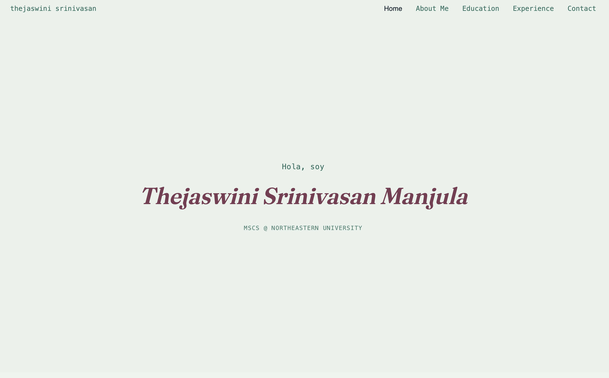
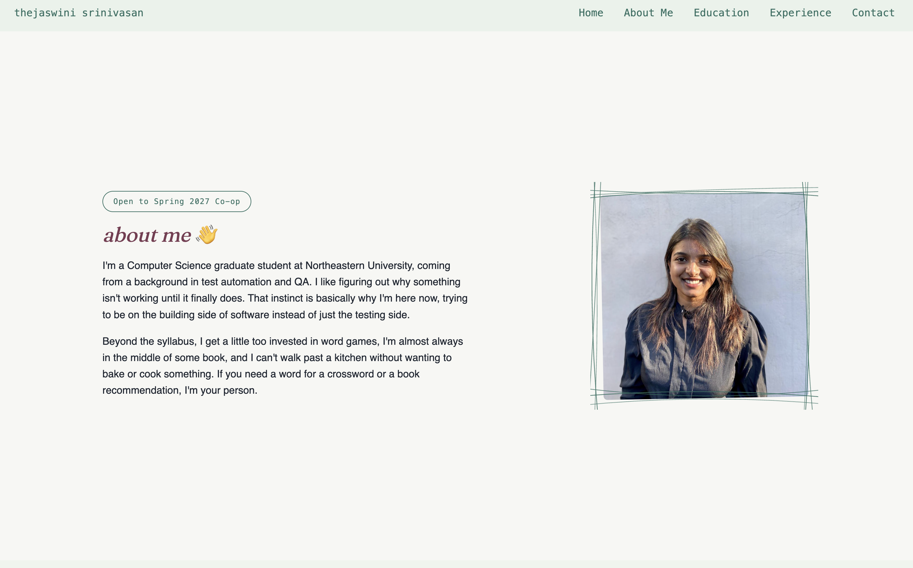
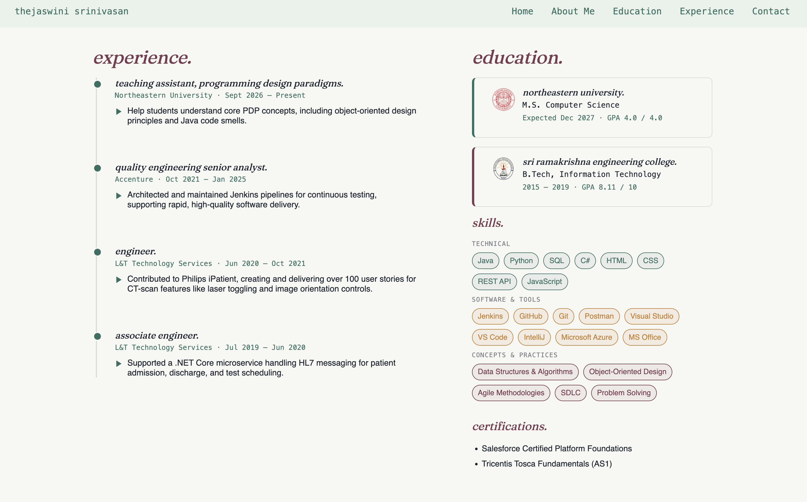
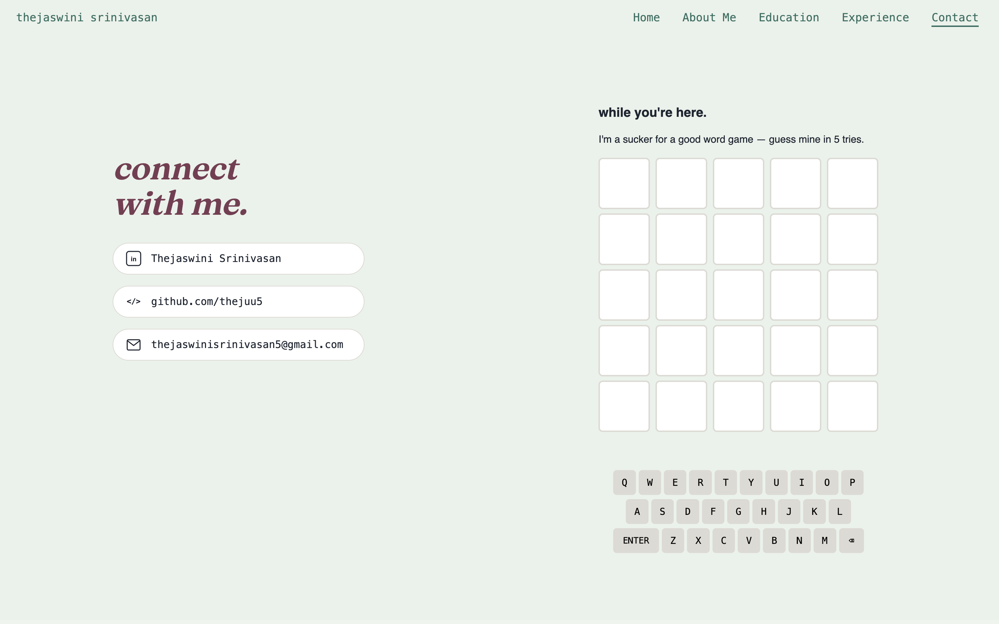

# Thejaswini Srinivasan Manjula — Personal Home Page

## Author

Thejaswini Srinivasan Manjula

## Project Description

This project is a personal portfolio website for Thejaswini Srinivasan
Manjula. The site presents my background, education, work experience, and
a way to get in touch, in a clean, multi-page, static front-end format. It
also doubles as a live portfolio for my Spring 2027 co-op search.

## Project Objective

The goal of this assignment was to build a personal homepage using vanilla
HTML5, CSS3, and ES6+.No backend, no component libraries that
introduces who I am, shows my education and experience, and gives visitors
a way to reach me, while meeting the course's technical requirements
(semantic structure, responsive layout, linting/formatting, an original
JS feature, and a public deployment).

## Course

CS5610 Web Development
Northeastern University
Instructor: John Alexis Guerra Gomez
Course Link: `https://johnguerra.co/classes/webDevelopment_online_fall_2026/`

## Submission URL

- Deployed URL (GitHub Pages): 
- Presentation (Google Slides): https://docs.google.com/presentation/d/1_-ByEgq43P4vHfF_GhlKXdv9hYGdOeKNo-_5ObdJTHM/edit?usp=sharing
- Video Demonstration: https://youtu.be/a6HAO-U1-eo

### Design Document

- [View Design Document](https://github.com/thejuu5/thejuu5-github.io/blob/main/Design_Document.pdf)


### Screenshots










## Technologies Used

- HTML5
- CSS3 (Grid & Flexbox — no Bootstrap or other component libraries)
- Vanilla JavaScript (ES6 Modules)
- ESLint
- Prettier
- Git & GitHub
- GitHub Pages

## Pages Included

### Home (`index.html`)

A single full-height hero: my name, a small rotating line above it that
cycles between a plain greeting, a `console.log(...)`-styled line, and a
Spanish greeting, plus my current role.

### About (`about.html`)

A short bio with my background in test automation/QA, why I'm now studying
software engineering, and a few personal interests alongside a photo.

### Education & Experience (`education.html`)

A two-column page: a work-experience timeline on the left (each entry
collapses to a one-line summary you can expand for detail) and my
education, skills, and certifications on the right.

### Contact (`contact.html`)

LinkedIn, GitHub, and email links, plus a small Wordle-style word game.
This is the AI-generated page required by the assignment

## Creative Addition

The homepage's rotating greeting line (plain text → styled code line →
Spanish, cycling automatically) is implemented in vanilla ES6, no
libraries. The Contact page separately includes a self-contained
Wordle-style word game (random word each load, on-screen and physical
keyboard support, color feedback) as a second original JS feature.

## Instructions to Build & Run

### Prerequisites

- Node.js
- npm
- A modern web browser

This is a static front-end website. Node.js and
npm are only used for the dev tools (ESLint, Prettier).

### 1. Clone the repository

```bash
git clone https://github.com/thejuu5/<repo-name>.git
cd <repo-name>
```

### 2. Install dependencies

```bash
npm install
```

Installs the dev dependencies listed in `package.json` (ESLint, Prettier,
and their plugins).

### 3. Run the website locally

Open `index.html` directly, or use a local server such as the VS Code
Live Server extension

### 4. Lint and format

```bash
npm run lint
npm run format
```

### 5. View the deployed website


## Demo Video


## Image and Resource Attribution

- Profile photo: personal photo, provided by Thejaswini Srinivasan Manjula.
- Northeastern University and Sri Ramakrishna Engineering College seals:
  official institutional logos, background removed for use as small badge
  icons on the Education page.
- site logo (`logo-ts.png`) - original graphics created for this project

## Generative AI Usage

### Claude (Anthropic), Sonnet 5

**Usage — used it on the experience and education page**

```text
The education and the experience tabs on my nav bar points to the same page. 
What can I do to add some response so that when the I click on education while on the
education and experience page, the page should refresh again or page should be reactive.
```
**Usage - on Home Page:**

```text
I have included Hello which says in english, spanish and console.log. 
Right now I have hardcoded in HTML. How can I do it without hardcoding it.
```

**Usage - on Contacts Page:**

```text
Can you generate a html page and css which has contact information along
with something like a small Wordle clone.

First walk me through the design of the page and only when I agree, you can start working on it. For every change made, ask before making any change.
```

### Learning

Claude was also used conversationally to explain specific web-dev
concepts as they came up (e.g. what `package.json`/ESLint/Prettier
configs actually do, CSS Grid vs. Flexbox, why ES6 modules fail over
`file://`).

## Repository Files

- [index.html](index.html) — Home page
- [about.html](about.html) — About page
- [education.html](education.html) — Education & Experience page
- [contact.html](contact.html) — Contact page (AI-generated)
- [css/style.css](css/style.css) — Styling for the entire site
- [js/main.js](js/main.js) — Rotating greeting + timeline accordion logic
- [js/contact.js](js/contact.js) — Word game logic (Contact page only)

## License

This project is licensed under the MIT License. See [LICENSE](LICENSE).
